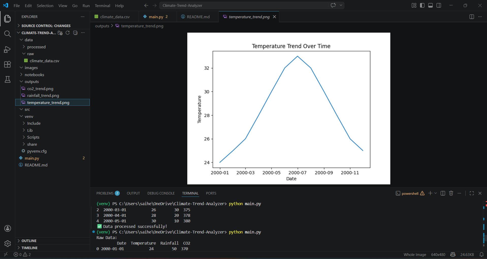
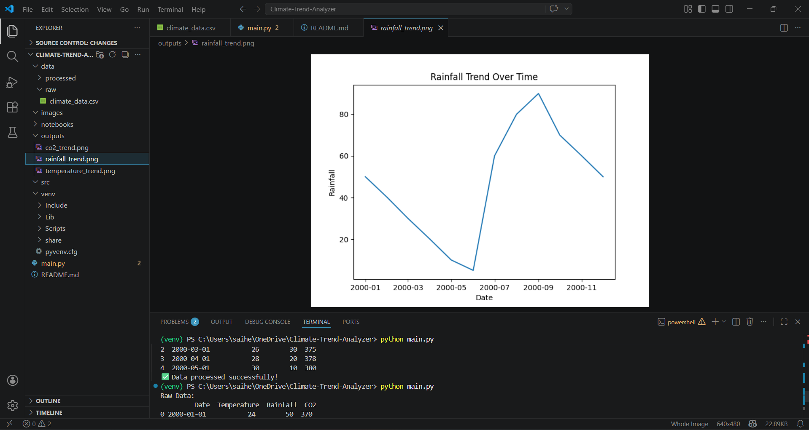
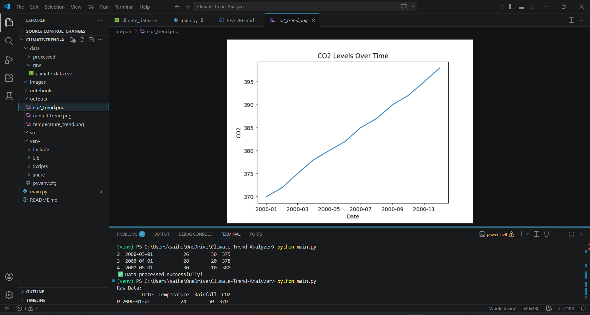
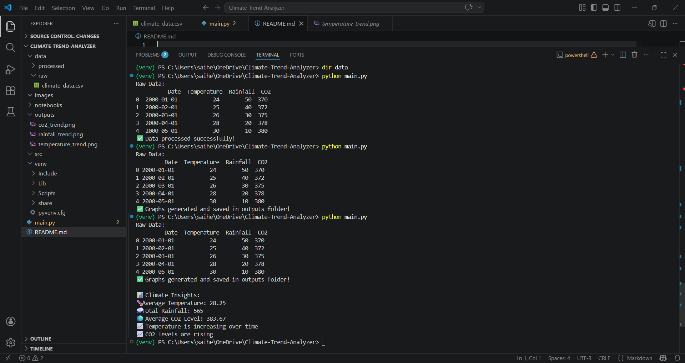

# 🌍 Climate Trend Analyzer

## 📌 Project Overview

The **Climate Trend Analyzer** is a data science project designed to analyze historical climate data and uncover meaningful patterns in temperature, rainfall, and CO₂ levels over time.

This project demonstrates how raw environmental data can be transformed into actionable insights using data analysis and visualization techniques.

---

## 🎯 Problem Statement

Climate change is one of the most critical global challenges. However, raw climate data is often complex and difficult to interpret.

This project aims to:

* Analyze climate patterns over time
* Identify increasing or decreasing trends
* Generate insights that support environmental understanding

---

## 🌎 Industry Relevance

Climate analytics is widely used in:

* Environmental Research
* Government Policy Planning
* Agriculture & Irrigation
* Energy & Sustainability
* Climate-Tech Startups

Organizations rely on such analysis to make **data-driven decisions** regarding climate risks and sustainability.

---

## 🚀 Key Features

* 📊 Data Loading and Preprocessing
* 📈 Trend Analysis (Temperature, Rainfall, CO₂)
* 📉 Data Visualization using graphs
* 🔍 Insight Generation from climate data
* 📁 Clean project structure for scalability

---

## 🛠️ Tech Stack

* **Python**
* **Pandas**
* **Matplotlib**

---

## 📂 Project Structure

```
Climate-Trend-Analyzer/
│
├── main.py
├── data/
│   ├── raw/
│   └── processed/
├── outputs/
├── images/
└── README.md
```

---

## ▶️ How to Run the Project

1. Activate virtual environment:

```
venv\Scripts\activate
```

2. Run the project:

```
python main.py
```

---

## 📊 Outputs Generated

The project generates the following outputs:

* ✔ Temperature Trend Graph
* ✔ Rainfall Trend Graph
* ✔ CO₂ Trend Graph
* ✔ Processed Dataset (`cleaned_data.csv`)
* ✔ Climate Insights (printed in terminal)

---

## 📸 Output Screenshots

### 🌡️ Temperature Trend



### 🌧️ Rainfall Trend



### 🌍 CO₂ Trend



### 🖥️ Terminal Output



---

## 📈 Key Insights

* Temperature shows a gradual increasing trend
* CO₂ levels are consistently rising over time
* Rainfall patterns show seasonal variation

---

## 🧠 Learning Outcomes

Through this project, I gained hands-on experience in:

* Data preprocessing and cleaning
* Time-series trend analysis
* Data visualization techniques
* Extracting insights from real-world datasets

---

## 🔮 Future Improvements

* Add machine learning-based forecasting
* Build an interactive dashboard (Streamlit)
* Integrate real-time climate APIs
* Perform region-wise climate comparison

---

## 🙏 Acknowledgment

I would like to sincerely thank my mentor for providing this project opportunity and guiding me to enhance my knowledge, skills, and confidence in data science.

---

## 👤 Author

S.Hemalatha
Aspiring Data Scientist | Passionate about Data Analytics & Real-World Problem Solving
